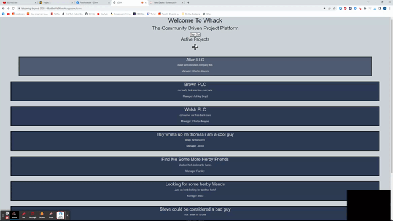

# WACK - Task Manager

## Technology's Used

-[Sequelize](https://sequelize.org/)
 
-[Express](https://expressjs.com/)
 
-[Bcrypt](https://www.npmjs.com/package/bcrypt)
 
-[HandleBars](https://handlebarsjs.com/)
 
-[Bootstrap](https://getbootstrap.com/)
 
-[AniJs](https://anijs.github.io/)
 
-[SweetAlert2](https://sweetalert2.github.io/)

## Description
This is a open source project board designed with collaboration in mind. You can create a project and other people can add tasks and complete tasks. You can comment on other projects as well to let them know what you think. If you love a project, go ahead and work on some of the tasks even add your own. Visit the deployed site [here.](https://blooming-beyond-30251-89ceb9e97d3f.herokuapp.com/)

## Usage
Using this app is very easy. First sign in.
 

 
Then you can create a project by clicking the plus.
 

 
Finally you can add tasks and comments to your or anyone elses project.
 

## Live Demo
Click [here](https://drive.google.com/file/d/1YmUcCWd5chjjUXFOy9F4Ywi-cokgU5fd/view) for a live demo!
## License

